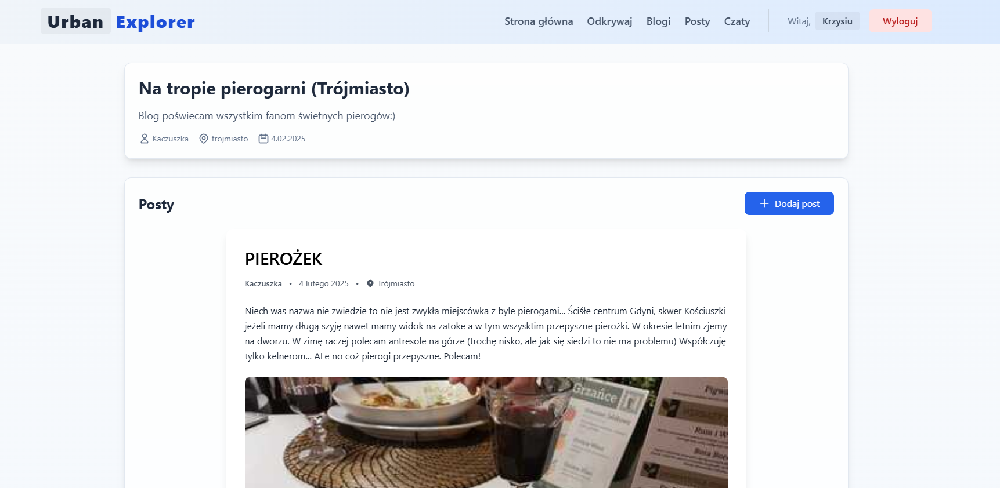

# UrbanExplorer

UrbanExplorer is a web application for urban exploration and community sharing, developed using Next.js, MongoDB, and real-time communication tools. This project was developed as part of my studies.

The main idea behind it was to let users discover interesting places in cities, write blogs, share posts, and connect with other explorers.

## Screenshots

### Main Page

### Explore City Page

### Search Blog Page

## Features
- City exploration and place discovery
- Blog and post creation
- Real-time chat in city and place-specific rooms
- User authentication
- Voting system for content ranking
- Commenting on posts and places
- Admin panel for managing users, content, and cities
- Responsive design

## Technologies Used
- **Frontend**: Next.js, Tailwind CSS
- **Backend**: Node.js, Express, Socket.IO, MQTT
- **Database**: MongoDB (with Mongoose)
- **Authentication**: Custom system with bcrypt password hashing

## Author

Damian Mitros